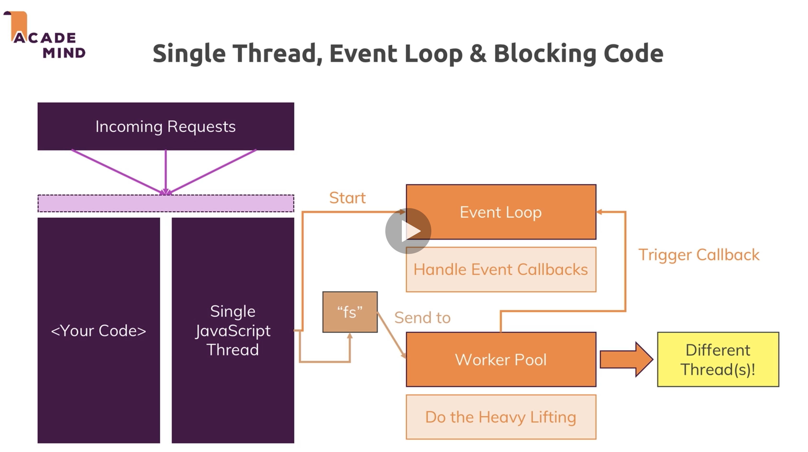
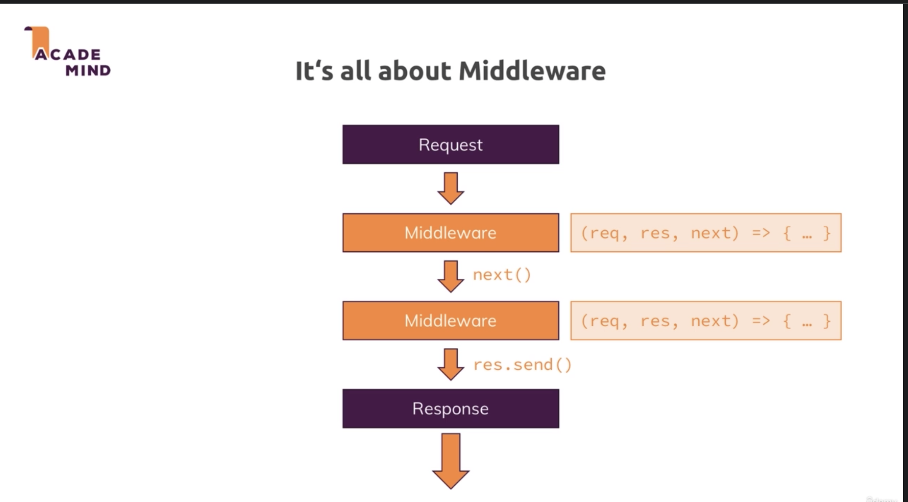
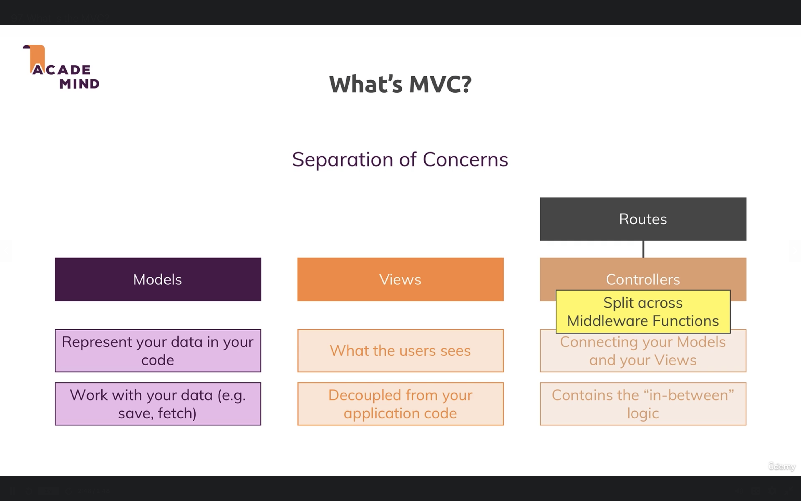
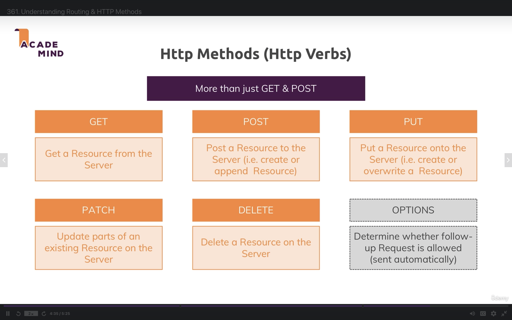
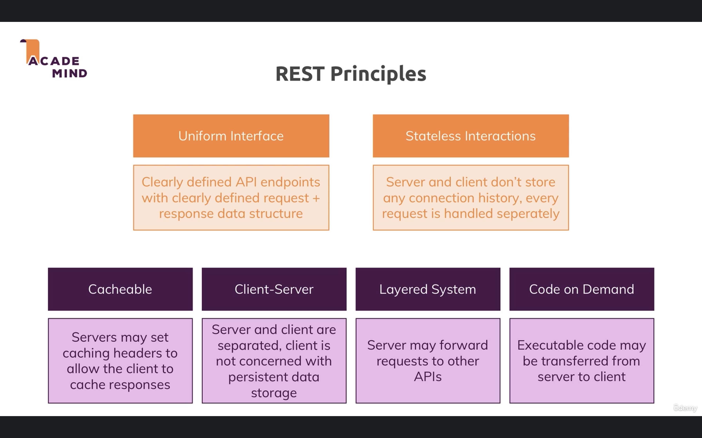

# learn-node-express-js
Learning Node.js with Express.js and other powerful librabies


### Start the app
```
nodemon index.js
```

# DON'T BLOCK THE EVENT LOOP!!


# MIDDLEWARES


# MVC


# REST Methods


# REST Principles
